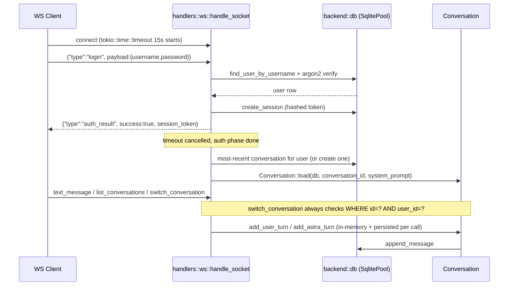

[[PLANS|← Plans]]

# Multi-User Accounts, Authentication, and Conversation Sessions

Full implementation plan produced by a cloud Ultraplan session (refining the initial local plan), approved by the user for self-directed implementation. Exported verbatim for reference. Distilled versions of the key decisions live in [[Decisions]] (2026-07-02 entries); task breakdown lives in [[Roadmap]] Phase 3 and [[Todos]] Backlog.

Astra currently has no identity concept. `/ws` (`src/main.rs:21`) is a single open route — anyone who reaches port 3000 connects and starts chatting. `AppState` (`src/backend/state.rs:16-34`) is one global struct (tools, system prompt, Ollama config, Spotify token, HA client) cloned per-connection. `Conversation` (`src/backend/conversation.rs`) is a bare in-memory `Vec<OllamaMessage>` built fresh in `handle_socket` (`src/handlers/ws.rs:24`) and dropped when the socket closes — no id, no persistence, one thread per connection.

This was a deliberate deferral, confirmed in the Obsidian vault: `Roadmap.md` lists "Authentication / multi-user support" under "What Is Not In Scope Yet," and `Decisions.md` (2026-06-20, "Astra owns all conversation state") explicitly says persistence is "deferred until multi-session or restart-survival is needed." That threshold has now been reached — real multi-user accounts: password auth, session tokens, per-user conversation history, built over the existing WebSocket-only transport per `CLAUDE.md`'s transport rule (auth is a new message type over `/ws`, not a new HTTP surface). Per-user Spotify/HA credentials are an explicit non-goal for this pass — the schema leaves room for a future `user_integrations` table but doesn't build it.

Deployment is LAN/ZeroTier-only today, but built to real security practices (hashed passwords, hashed session tokens, ownership checks) rather than a shortcut that assumes a trusted network forever.

## Flow



## Verified dependency choices

Checked against crates.io and RustCrypto/sqlx source directly (not assumed from training data):

- `sqlx` current stable is **0.9.0**, not 0.8. The 0.9 changelog has no breaking change touching sqlite/migrate/runtime-tokio.
- `tls-rustls` is **not needed** — confirmed from sqlx's `Cargo.toml`: TLS features are independent of sqlite/runtime-tokio. SQLite is a local file, no network TLS involved.
- Use **`"derive"`**, not `"macros"`: `#[derive(sqlx::FromRow)]` only needs `derive = ["sqlx-macros/derive"]`. `"macros"` additionally pulls in the compile-time `query!`/`query_as!` macros that need a live DB at build time — defer those, start with the plain runtime-checked `sqlx::query(...)`/`query_as::<_, T>(...)` API.
- **Skip `password-hash` and `rand` as separate top-level deps.** Confirmed from `argon2`'s source (`argon2-v0.5.3/src/lib.rs`): with default features (`default = ["alloc", "password-hash", "rand"]`), `argon2` re-exports `argon2::password_hash::{self, PasswordHash, PasswordHasher, PasswordVerifier}`, and `password-hash` itself re-exports `pub use rand_core` when its `rand_core` feature is on (enabled transitively via argon2's `rand` feature: `rand = ["password-hash/rand_core"]`). So `argon2::password_hash::rand_core::OsRng` is reachable with zero extra crates — use it for both Argon2 salt generation and session-token random bytes. This also avoids version-skew: `argon2 0.5.3` pins `password-hash = "0.5"` internally, so declaring a separate `password-hash = "0.6"` (its current stable) would create two incompatible `password_hash` types in the dependency graph.
- `argon2 = "0.5"` is correct as-is — 0.5.3 is current stable; 0.6 is only `0.6.0-rc.2`.
- `sha2`: use `"0.11"` (current stable), not `"0.10"`.
- `uuid = "1"`, `chrono = "0.4"` are fine (current stable 1.23.4 / 0.4.45).
- Add `rpassword = "7"` (current stable 7.5.4) for hidden password entry in the CLI user-creation path — matches the "real security practices" goal (no plaintext password echoed to terminal).

```toml
sqlx = { version = "0.9", default-features = false, features = [
    "runtime-tokio", "sqlite", "derive", "migrate", "uuid", "chrono"
] }
argon2 = "0.5"
uuid = { version = "1", features = ["v4", "serde"] }
chrono = { version = "0.4", features = ["serde"] }
sha2 = "0.11"
rpassword = "7"
```

## Startup wiring

`AppState::new()` (`src/backend/state.rs`) loads Whisper, TTS, Spotify/HA clients — multi-second, hardware-dependent work the CLI user-creation path must not trigger just to insert a row. So:

- `src/backend/db.rs` exposes `pub async fn connect_and_migrate() -> SqlitePool` (opens `sqlite://.astra/astra.db?mode=rwc`, runs `sqlx::migrate!()`).
- `main()` calls this first, then branches: if argv matches the CLI subcommand, handle it and return — never touching `AppState::new()`. Otherwise pass the pool into `AppState::new(pool: SqlitePool) -> Self` (one new parameter) and start the server as today.
- Add `.astra/astra.db` and `.astra/astra.db-*` (WAL sidecars) to `.gitignore`, next to the existing `astra.conf` entry.

## Database schema and migrations

`migrations/` at repo root (sibling to `Cargo.toml`), embedded via `sqlx::migrate!()`:

```
migrations/
├── 0001_create_users.sql
├── 0002_create_sessions.sql
├── 0003_create_conversations.sql
└── 0004_create_messages.sql
```

```sql
-- users
CREATE TABLE users (
    id            TEXT PRIMARY KEY,           -- uuid v4 as text (SQLite has no native UUID type)
    username      TEXT NOT NULL UNIQUE,
    password_hash TEXT NOT NULL,              -- full Argon2id PHC string
    created_at    TEXT NOT NULL,              -- RFC3339 text (SQLite has no native datetime type)
    is_admin      INTEGER NOT NULL DEFAULT 0  -- reserved seam for a future admin-gated register message
);

-- sessions
CREATE TABLE sessions (
    id           TEXT PRIMARY KEY,
    user_id      TEXT NOT NULL REFERENCES users(id) ON DELETE CASCADE,
    token_hash   TEXT NOT NULL UNIQUE,        -- SHA-256 of the raw token; raw token is never stored
    created_at   TEXT NOT NULL,
    expires_at   TEXT NOT NULL,
    last_seen_at TEXT NOT NULL
);
CREATE INDEX idx_sessions_user_id ON sessions(user_id);
CREATE INDEX idx_sessions_token_hash ON sessions(token_hash);

-- conversations (the "different chats" per user)
-- Future multiplayer seam: user_id is a single owner today. Shared conversations would
-- replace this with a conversation_participants(conversation_id, user_id) join table and
-- change the ownership check from a column match to an EXISTS query.
CREATE TABLE conversations (
    id         TEXT PRIMARY KEY,
    user_id    TEXT NOT NULL REFERENCES users(id) ON DELETE CASCADE,
    title      TEXT NOT NULL DEFAULT 'New conversation',
    created_at TEXT NOT NULL,
    updated_at TEXT NOT NULL
);
CREATE INDEX idx_conversations_user_id ON conversations(user_id);

-- messages (persistent counterpart to today's in-memory Conversation.history)
-- Future multiplayer seam: no per-message author. Fine today (one human per conversation),
-- but a shared conversation would need a nullable user_id column here (nullable because
-- assistant/tool messages have no human author) to know who sent a given user-role message.
CREATE TABLE messages (
    id              INTEGER PRIMARY KEY AUTOINCREMENT,
    conversation_id TEXT NOT NULL REFERENCES conversations(id) ON DELETE CASCADE,
    role            TEXT NOT NULL,   -- mirrors backend::ollama::types::Role, lowercase via existing serde rename
    content         TEXT NOT NULL,
    tool_calls      TEXT,            -- JSON-serialized, NULL when absent
    created_at      TEXT NOT NULL
);
CREATE INDEX idx_messages_conversation_id ON messages(conversation_id);
```

## New modules (following this project's `foo.rs` + `foo/` convention — never `mod.rs`)

```
src/backend/db.rs                — connect_and_migrate(); pub mod users; pub mod sessions;
                                    pub mod conversations; pub mod messages;
src/backend/db/users.rs          — create_user, find_user_by_username
src/backend/db/sessions.rs       — create_session, find_session_by_token_hash, touch_session, delete_session
src/backend/db/conversations.rs  — create_conversation, list_conversations_for_user, touch_conversation
src/backend/db/messages.rs       — append_message, load_messages
src/backend/auth.rs              — pub mod password; pub mod session; shared AuthError enum
src/backend/auth/password.rs     — hash_password / verify_password (Argon2id via argon2::password_hash)
src/backend/auth/session.rs      — generate_session_token, hash_token, SESSION_TTL
```

`auth.rs` has zero DB dependency by design — fastest thing to unit test in isolation.

**Important nuance:** password hashing (Argon2id, deliberately slow) and session-token hashing (SHA-256 via `sha2`, deliberately fast) use different algorithms on purpose. Argon2id's slowness defends against guessing a low-entropy human password; a session token is already high-entropy/random, so a slow hash only adds latency with no security benefit.

Add `pub mod db; pub mod auth;` to `src/backend.rs` (currently a flat list: `config`, `conversation`, `ollama`, `protocol`, `state`, `audio`).

## Protocol changes — `src/backend/protocol.rs`

`Message` is `#[serde(tag = "type", content = "payload", rename_all = "snake_case")]`, `Envelope.message` is `#[serde(flatten)]`. New variants follow this exact shape, matching how `AudioEnd`/`Transcript`/`TtsEnd` are already done.

New payload structs: `LoginPayload { username, password }`, `ResumeSessionPayload { token }`, `AuthResultPayload { success, session_token: Option<String>, username: Option<String>, error: Option<String> }`, `ConversationSummary { id, title, updated_at }`, `ConversationListPayload { conversations: Vec<ConversationSummary> }`, `CreateConversationPayload { title: Option<String> }`, `SwitchConversationPayload { conversation_id }`, `ConversationSwitchedPayload { conversation_id, title }`.

New `Message` variants: `Login(LoginPayload)`, `ResumeSession(ResumeSessionPayload)`, `AuthResult(AuthResultPayload)`, `ListConversations` (unit, like `AudioEnd`), `ConversationList(ConversationListPayload)`, `CreateConversation(CreateConversationPayload)`, `SwitchConversation(SwitchConversationPayload)`, `ConversationSwitched(ConversationSwitchedPayload)`.

`Envelope` needs no changes — `request_id` stays a per-turn correlation id, echoed back on `AuthResult` like every other reply.

## `AppState` changes — `src/backend/state.rs`

Add one field: `pub db: sqlx::SqlitePool` (clones cheaply, already `Arc`-backed internally — consistent with every other field). `AppState::new()` becomes `AppState::new(pool: SqlitePool)`.

Do not add `user_id` or `conversation_id` to `AppState` — those stay local to `handle_socket`, the same way `Conversation` already works today (created fresh per connection, not shared/global).

## `src/handlers/ws.rs` changes — the auth gate

`handle_socket` currently builds `Conversation::new(&state.system_prompt)` immediately (line 24) and loops on `socket.recv()`. New shape: an auth phase runs first.

New `authenticate(socket: &mut WebSocket, state: &AppState) -> Option<(user_id, username)>`, wrapped in `tokio::time::timeout(Duration::from_secs(15), ...)` around the whole receive loop (a single deadline on the phase, not per-message). Inside: handle `Message::Login` (verify against `db::users` + `auth::password`, mint + hash a new session token, `db::sessions::create_session`, reply `AuthResult`) and `Message::ResumeSession` (hash the incoming token, look up `db::sessions::find_session_by_token_hash`, check `expires_at`, `touch_session`). Any other message type before auth completes gets a hard reject (`Error` + close), not silent ignoring. Failed logins always return the same generic `"invalid credentials"` error regardless of whether the username existed, to avoid username enumeration. If `authenticate` returns `None` (timeout or early close), `handle_socket` returns immediately.

After auth succeeds: load or create the user's most-recent conversation, then `Conversation::load(&state.db, conversation_id, &state.system_prompt)` (replacing today's `Conversation::new`). `run_agent_loop`'s existing signature doesn't need to change — persistence happens inside `Conversation`'s own methods.

New match arms for `ListConversations`, `CreateConversation`, `SwitchConversation` — each reassigns the local `conversation`/`conversation_id` variables.

**The one correctness detail that matters most in this whole plan:** `SwitchConversation` must verify the target conversation's `user_id` matches the authenticated caller (`WHERE id = ? AND user_id = ?`, never trusting a client-supplied id alone). Skipping this is the single missing `WHERE` clause that would let one user read another's conversation by guessing an id — treat this as a deliberate stop-and-check, not a routine query.

## `src/backend/conversation.rs` rework

Currently just `{ history: Vec<OllamaMessage>, max_tokens: usize }` with `new`, `add_user_turn`, `add_astra_turn`, `add_astra_tool_call`, `add_tool_result`, `enforce_window`.

`Conversation` gains `id: String` and `db: SqlitePool` fields. The DB `messages` table becomes the source of truth for the full transcript; `self.history` (and `enforce_window`) stays exactly what it is today — an in-memory trim of what actually gets sent to Ollama, not the persisted record. `enforce_window` must keep trimming the in-memory vec for context-size reasons, but must never delete rows from `messages`.

`Conversation::new(system_prompt)` is replaced by `Conversation::load(db, conversation_id, system_prompt)`, which hydrates recent history from the DB. Each `add_user_turn` / `add_astra_turn` / `add_astra_tool_call` / `add_tool_result` keeps its current in-memory behavior and additionally persists via `db::messages::append_message` in the same call, so the two never drift apart. Persist synchronously (await the DB write before returning) — SQLite writes are fast (single local file, no network hop), and this guarantees no message is lost between "sent to client" and "written to disk."

`Conversation` owns a cloned `SqlitePool` (not a borrowed `&SqlitePool`) — simpler to reason about across `.await` points, negligible cost since the pool clone is cheap.

## Order of implementation

1. Migrations (`migrations/*.sql`) — verify they apply cleanly (`sqlx::migrate!()` against a scratch DB) before writing any Rust.
2. `src/backend/db.rs` + submodules, including `connect_and_migrate()` — independently testable against `sqlite::memory:`.
3. `src/backend/auth.rs` + submodules — zero DB dependency, fastest feedback loop, good place to get comfortable with the `argon2` API.
4. `main.rs` CLI branch (`astra user create <username>`) — manual `std::env::args()` parsing (no clap needed for one subcommand), `rpassword` for hidden input, calls steps 2+3 directly, bypassing `AppState::new()` entirely so heavy models never load just to create a user. Verify with `sqlite3 .astra/astra.db` that the stored value is a real `$argon2id$...` hash.
5. Protocol additions in `protocol.rs` — no behavior yet, just needs to compile and round-trip through `serde_json` correctly (easy to get the `tag`/`content` shape subtly wrong).
6. `ws.rs` auth gate (`authenticate` + phase split), still against the old `Conversation::new` — isolates "is login/resume/timeout correct" from "is persistence correct" as separately-verifiable changes.
7. `conversation.rs` rework + the `ListConversations`/`CreateConversation`/`SwitchConversation` arms in `ws.rs`, including the ownership check.
8. `state.rs`/`main.rs` final wiring — `AppState::new(pool)` signature change, server path calls `connect_and_migrate()` then `AppState::new(pool)`. Deliberately last: everything above is testable against a standalone pool without touching the real startup path.
9. Obsidian vault updates as the closing step (see below).

## Obsidian vault updates (part of this task, not optional)

Per this project's collaboration rules, significant architectural decisions get logged immediately:

- **Decisions.md:** new entry — "SQLite + sqlx for persistence, opaque hashed session tokens over JWT, CLI-only account creation" — with the reasoning above (why SQLite not Postgres, why opaque tokens not JWT, why CLI-gated registration not a WS message).
- **Roadmap.md:** remove "Authentication / multi-user support" from "What Is Not In Scope Yet" (it's now in scope); add a phase section mirroring the existing phase format.
- **Architecture.md:** add new modules to the module table, update the request-flow diagram to show the auth gate before `run_agent_loop`, update "Conversation State" — storage is no longer purely in-memory.
- **Todos.md / Progress.md:** move completed items, dated summary entry.

## Verification

**`cargo test` targets:**

- `auth::password` — hash starts with `$argon2id$`; correct password verifies `Ok(true)`, wrong password verifies `Ok(false)` (not an `Err`); hashing the same password twice yields different strings (salted) but both still verify.
- `auth::session` — `generate_session_token()` output is long/random (two calls differ); `hash_token` is deterministic (same input → same output) since it's used as a lookup key.
- `protocol` — round-trip `Login`/`ResumeSession`/`AuthResult` envelopes through `serde_json::to_string`/`from_str` and assert the JSON shape matches what a client sends.
- `db::*` — against an in-memory SQLite pool with migrations applied: user create/lookup, session create/lookup/delete, and specifically the conversation-ownership check (two users, two conversations, assert user A's query for user B's conversation returns nothing). This is the most important test in the suite.

**Manual end-to-end** (no HTTP surface, so use `websocat` or a `tokio-tungstenite` scratch client):

```bash
cargo run -- user create alice
```

```
websocat ws://127.0.0.1:3000/ws
> {"type":"login","payload":{"username":"alice","password":"..."}}
< {"type":"auth_result","payload":{"success":true,"session_token":"...","username":"alice","error":null}}
> {"type":"text_message","payload":{"content":"hello","voice_response":false}}
< {"type":"text_chunk", ...}

websocat ws://127.0.0.1:3000/ws
> {"type":"resume_session","payload":{"token":"..."}}
< {"type":"auth_result", ...}

> {"type":"list_conversations"}
> {"type":"create_conversation","payload":{"title":"second chat"}}
> {"type":"switch_conversation","payload":{"conversation_id":"..."}}
```

Negative tests worth doing by hand: open a socket and send nothing — confirm it's dropped after the 15s auth timeout; log in as alice and try `SwitchConversation` with a conversation id known to belong to another user — confirm rejection; submit a wrong password — confirm the error doesn't reveal whether the username existed.

## New-to-Rust concepts to slow down for

- `sqlx::SqlitePool` as a connection pool — how it differs from the `Arc<Mutex<_>>` pattern already used for `tts`/`whisper_ctx`, and why cloning it is cheap.
- `sqlx::migrate!()`'s compile-time-embed + runtime-diff pattern ("migrations as code").
- `tokio::time::timeout` wrapping an async loop, and what "cancelled" means for the in-flight `.await` when it fires.
- Owned `SqlitePool` clone vs. a borrowed `&'a SqlitePool` on `Conversation`, and why owned wins here.
- Argon2id (slow, for passwords) vs. SHA-256 (fast, for session tokens) — same-looking "hash a string" call, opposite requirements.
- `argon2::password_hash::rand_core::OsRng` — why it's reachable without adding `rand` as a dependency (re-export chain: `argon2` → `password_hash` → `rand_core`).
- The `SwitchConversation` ownership check — the one place multi-user isolation actually lives.
